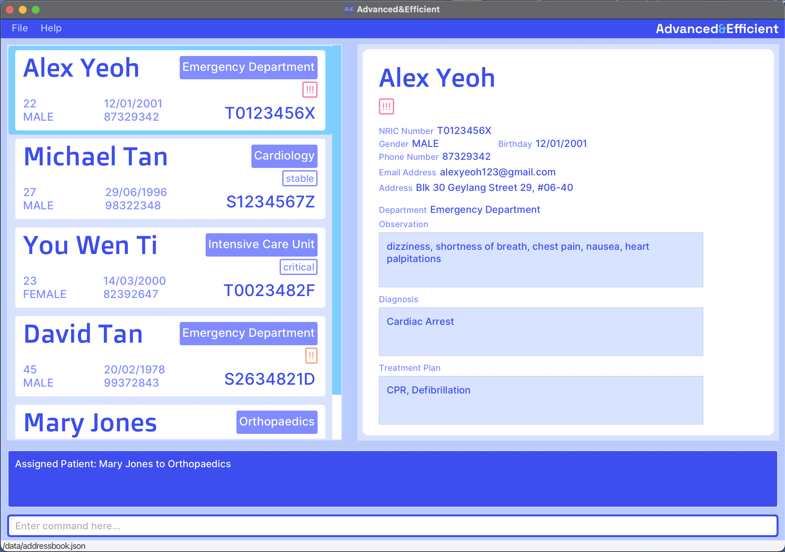

* **Advanced&Efficient (A&E)** is a desktop application that helps Emergency Department (ED) doctors in managing 
patient records and connecting patients to relevant departments.  

* Features:
  * Has a Graphical User Interface (GUI) while also supporting user interactions via a **Command-Line Interface (CLI)**
  for increased convenience and efficiency for users
  * Allows ED doctors to easily manage and organize a database of patients through actions such as adding and deleting 
  patient entries, editing and tagging records, and searching
  * Runs on any computer with **Java 11** installed
* The project is an ongoing software project as part of the 
[NUS CS2103T Software Engineering course for AY23/24 Semester 1](https://nus-cs2103-ay2324s1.github.io/website/index.html).
  * This project is a brownfield project based on the **AddressBook-Level3** project created by the 
  [SE-EDU initiative](https://se-education.org).
  * It is **written in OOP fashion** and provides a **reasonably well-written** code base (around 6 KLoC).
  * It comes with a **reasonable level of user and developer documentation**.
* For the detailed documentation of this project, see the **[Advanced&Efficient (A&E) Product Website](https://ay2324s1-cs2103t-t14-2.github.io/tp/)**.
