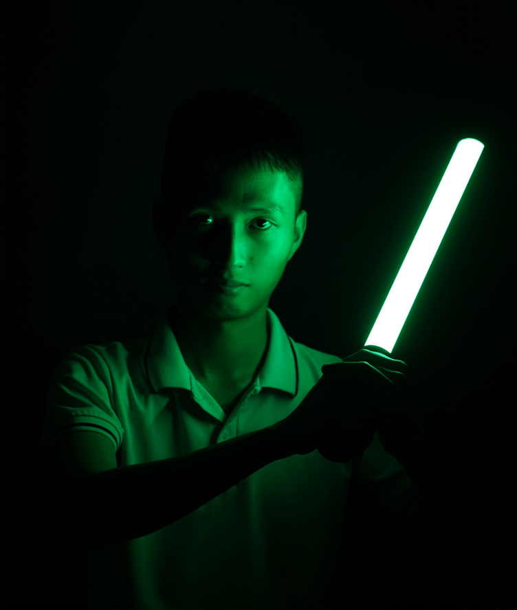
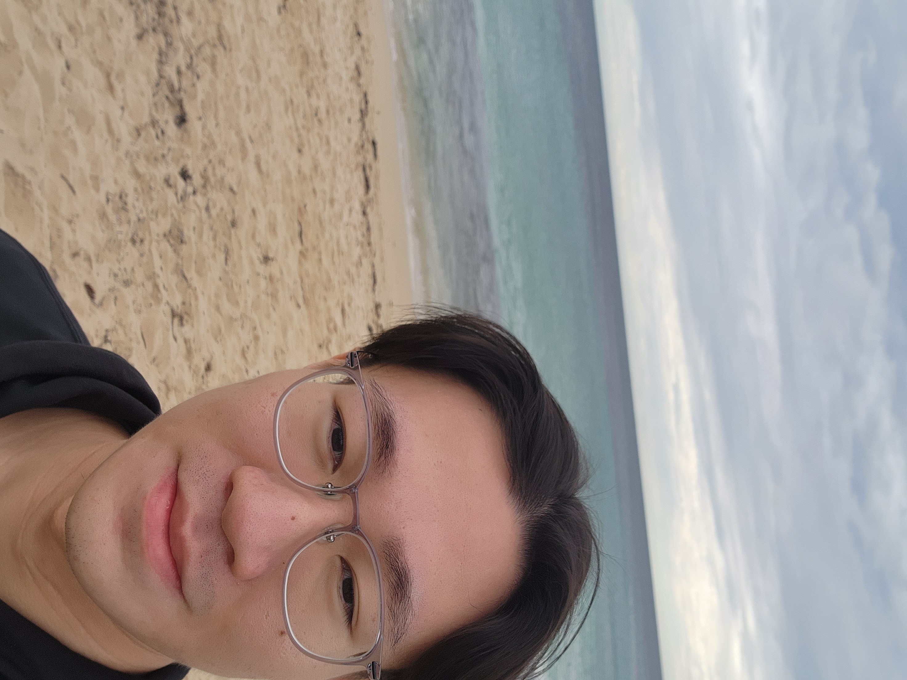

# About Us

We are a team based in the [School of Computing, National University of Singapore](http://www.comp.nus.edu.sg).

You can reach us at the email `seer[at]comp.nus.edu.sg`

## Project team

### Long Nguyen Tan

[[github](https://github.com/longnguyentan)]
[[portfolio](team/longng.md)]

* Role: Developer
* Responsibilities: Testing, Integration

### Aaron Joel Tan Tze Ern

[[github](http://github.com/aaronjt1)]
[[portfolio](team/johndoe.md)]

* Role: Developer
* Responsibilities: Scheduling and tracking, Git Expert

### Lee Thien My

[[github](http://github.com/thienmy0)] [[portfolio](team/johndoe.md)]

* Role: Developer
* Responsibilities: Deliverables and Deadline

### Mehta Riya Mehulbhai

[[github](http://github.com/RiyaMehta2211)]
[[portfolio](team/johndoe.md)]

* Role: Developer
* Responsibilities: Code Quality

### Wu Jingya

[[github](http://github.com/wujy28)]
[[portfolio](team/johndoe.md)]

* Role: Developer
* Responsibilities: Documentation
