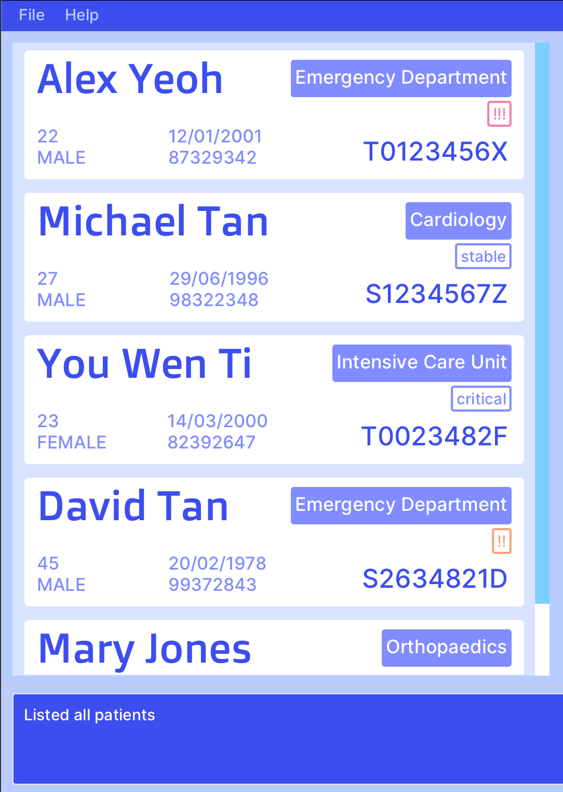

# Advanced&Efficient (A&E) User Guide

Advanced&Efficient (A&E) is a Command-Line Interface (CLI) focussed app that helps Emergency Department (ED) doctors log patient reports and connect them to the relevant departments. It is suited for users who type fast and prefer typing over other modes of inputs.

<!-- * Table of Contents -->
- [Quick-start](#quick-start)
- [Features](#features)
  - [Viewing help : `help`](#viewing-help--help)
  - [Listing all patients: `list patients`](#list-all-patients--list)
  - [Delete a patient: `delete`](#delete-a-patient--delete)
  - [Adding a patient: `add`](#adding-a-patient--add)
  - [Viewing a patient record : `view`](#subsection-1-1)
  - [Edit a patient record : `record`](#subsection-1-1)
  - [Assign patient to department : `assign`](#subsection-1-1)
  - [Exiting the program : `exit`](#exiting-the-program--exit)
- [FAQ](#FAQ)
- [Known Issues](#Known-issues)
- [Command summary](#Command-summary)

<page-nav-print />

--------------------------------------------------------------------------------------------------------------------

## Quick start

###  [coming soon]

--------------------------------------------------------------------------------------------------------------------

## Features

<box type="info" seamless>

**Notes about the command format:** 

* Words in `UPPER_CASE` are the parameters to be supplied by the user. 
  e.g. in `add n/NAME`, `NAME` is a parameter which can be used as `add n/John Doe`.

* Items in square brackets are optional. 
  e.g `n/NAME [t/TAG]` can be used as `n/John Doe t/friend` or as `n/John Doe`.

* Items with `…`​ after them can be used multiple times including zero times. 
  e.g. `[t/TAG]…​` can be used as ` ` (i.e. 0 times), `t/friend`, `t/friend t/family` etc.

* Parameters can be in any order. 
  e.g. if the command specifies `n/NAME p/PHONE_NUMBER`, `p/PHONE_NUMBER n/NAME` is also acceptable.

* Extraneous parameters for commands that do not take in parameters (such as `help`, `list`, `exit` and `clear`) will be ignored. 
  e.g. if the command specifies `help 123`, it will be interpreted as `help`.

* If you are using a PDF version of this document, be careful when copying and pasting commands that span multiple lines as space characters surrounding line-breaks may be omitted when copied over to the application.
</box>

### Viewing help : `help`

Shows a message explaining how to access the help page.

Format: `help`

### List All Patients: `list`

Lists all patients in the system.

Format: `list patients`

### Delete a Patient: `delete`

Deletes the patient with the specified IC number from the system. Inputs are not case-sensitive (e.g., `T1234567A` is the same as `t1234567a`). The order of the inputs does not matter.

Format: `delete i/IC_NUMBER`

Examples:

- `delete i/T1234567A`
- `delete i/T2468012a`

### Adding a Patient: `add`

Adds the specified patient into the system.

Format: `add n/NAME i/IC_NUMBER a/AGE g/GENDER b/BIRTHDAY p/PHONE_NUMBER e/EMAIL a/ADDRESS`
+ Only the `i/IC_NUMBER` field is compulsory.
+ Input fields are case-insensitive e.g. `john doe` is the same as `JOHN DOE`.
+ The order of the input fields does not matter.

Examples:
* `add n/John Doe a/33 g/m b/01-01-1990 i/T0123456A p/98765432 e/johnd@example.com a/John street, block 123, #01-01`
* `add n/Betsy Crowe p/87386298 a/20 g/Female b/02-02-2003 e/betsycrowe@example.com a/Brighton Town i/T6543210F`

### Listing all persons : `list`

Shows a list of all persons in the address book.

Format: `list`

### Editing a person : `edit`

Edits an existing person in the address book.

Format: `edit INDEX [n/NAME] [p/PHONE] [e/EMAIL] [a/ADDRESS] [t/TAG]…​`

* Edits the person at the specified `INDEX`. The index refers to the index number shown in the displayed person list. The index **must be a positive integer** 1, 2, 3, …​
* At least one of the optional fields must be provided.
* Existing values will be updated to the input values.
* When editing tags, the existing tags of the person will be removed i.e adding of tags is not cumulative.
* You can remove all the person’s tags by typing `t/` without
    specifying any tags after it.

Examples:
*  `edit 1 p/91234567 e/johndoe@example.com` Edits the phone number and email address of the 1st person to be `91234567` and `johndoe@example.com` respectively.
*  `edit 2 n/Betsy Crower t/` Edits the name of the 2nd person to be `Betsy Crower` and clears all existing tags.

### Locating persons by name: `find`

Finds persons whose names contain any of the given keywords.

Format: `find KEYWORD [MORE_KEYWORDS]`

* The search is case-insensitive. e.g `hans` will match `Hans`
* The order of the keywords does not matter. e.g. `Hans Bo` will match `Bo Hans`
* Only the name is searched.
* Only full words will be matched e.g. `Han` will not match `Hans`
* Persons matching at least one keyword will be returned (i.e. `OR` search).
  e.g. `Hans Bo` will return `Hans Gruber`, `Bo Yang`

Examples:
* `find John` returns `john` and `John Doe`
* `find alex david` returns `Alex Yeoh`, `David Li` 
  

### Deleting a person : `delete`

Deletes the specified person from the address book.

Format: `delete INDEX`

* Deletes the person at the specified `INDEX`.
* The index refers to the index number shown in the displayed person list.
* The index **must be a positive integer** 1, 2, 3, …​

Examples:
* `list` followed by `delete 2` deletes the 2nd person in the address book.
* `find Betsy` followed by `delete 1` deletes the 1st person in the results of the `find` command.

### Assigning a patient to a department : `assign`

Assigns the patient to relevant doctor.

Format: `assign i/IC_NUMBER d/DEPARTMENT`
* All fields are compulsory
* Inputs are case-insensitive e.g. `T1234567A` is the same as `t1234567a`
* `DEPARTMENT` must adhere to British spelling conventions

Examples:
* `assign i/T02012345A d/cardiology`

### Exiting the program : `exit`

Exits the program.

Format: `exit`

### Saving the data

AddressBook data are saved in the hard disk automatically after any command that changes the data. There is no need to save manually.

### Editing the data file

AddressBook data are saved automatically as a JSON file `[JAR file location]/data/addressbook.json`. Advanced users are welcome to update data directly by editing that data file.

<box type="warning" seamless>

**Caution:**
If your changes to the data file makes its format invalid, AddressBook will discard all data and start with an empty data file at the next run.  Hence, it is recommended to take a backup of the file before editing it.
</box>

### Archiving data files `[coming in v2.0]`

_Details coming soon ..._

--------------------------------------------------------------------------------------------------------------------

## FAQ

###  [coming soon]

--------------------------------------------------------------------------------------------------------------------

## Known issues

###  [coming soon]

--------------------------------------------------------------------------------------------------------------------

## Command summary

Action     | Format, Examples
-----------|----------------------------------------------------------------------------------------------------------------------------------------------------------------------
**Add**    | `add n/NAME p/PHONE_NUMBER e/EMAIL a/ADDRESS [t/TAG]…​`   e.g., `add n/James Ho p/22224444 e/jamesho@example.com a/123, Clementi Rd, 1234665 t/friend t/colleague`
**Clear**  | `clear`
**Delete** | `delete INDEX`  e.g., `delete 3`
**Edit**   | `edit INDEX [n/NAME] [p/PHONE_NUMBER] [e/EMAIL] [a/ADDRESS] [t/TAG]…​`  e.g.,`edit 2 n/James Lee e/jameslee@example.com`
**Find**   | `find KEYWORD [MORE_KEYWORDS]`  e.g., `find James Jake`
**List**   | `list`
**Help**   | `help`
