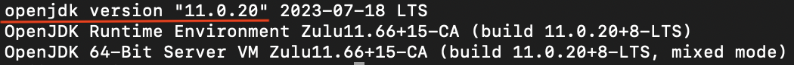
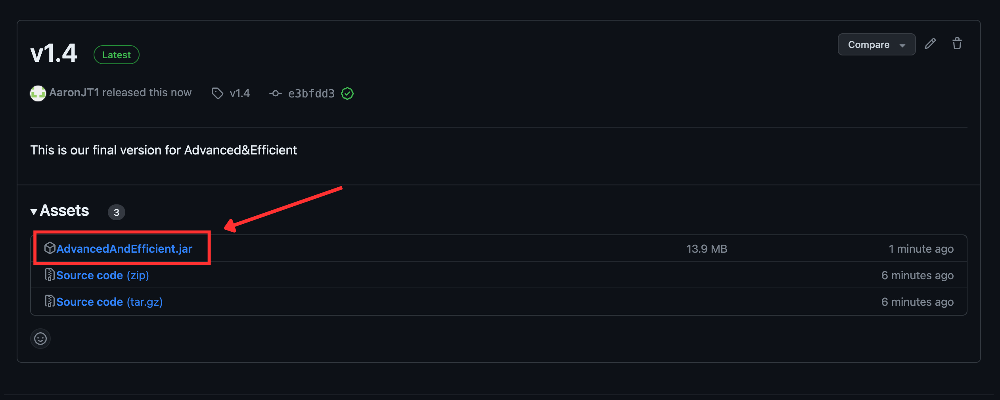
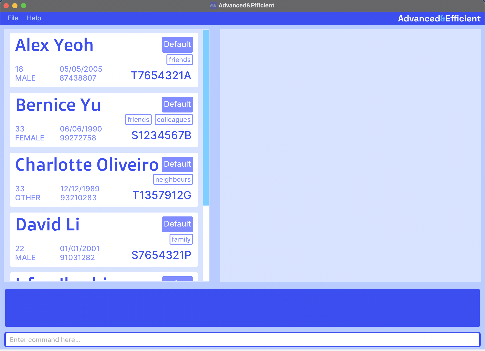
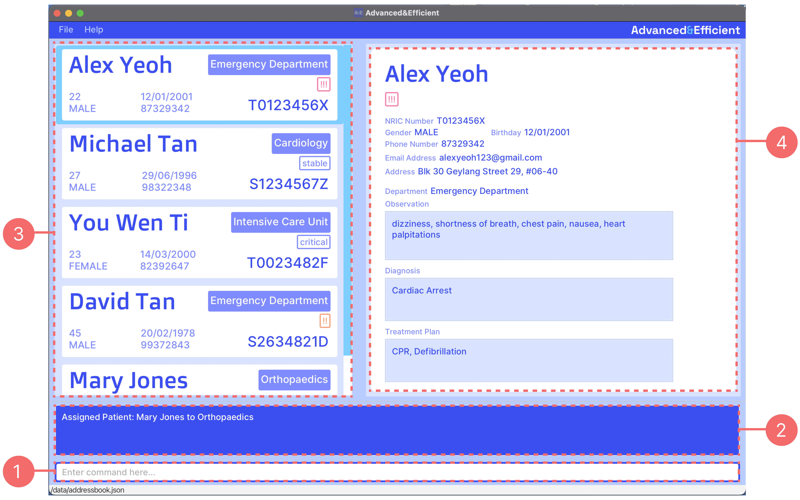
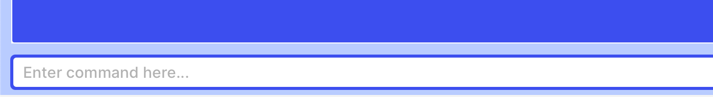
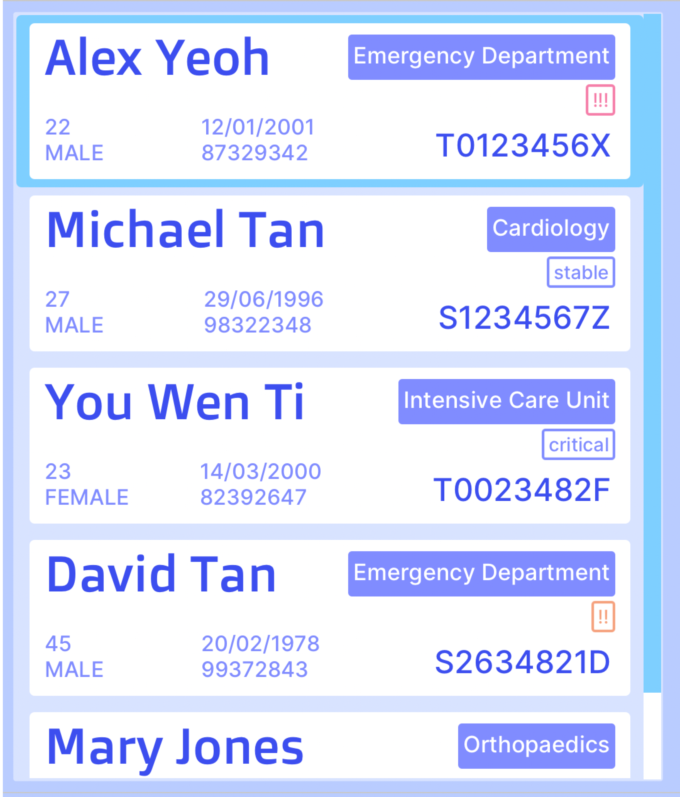
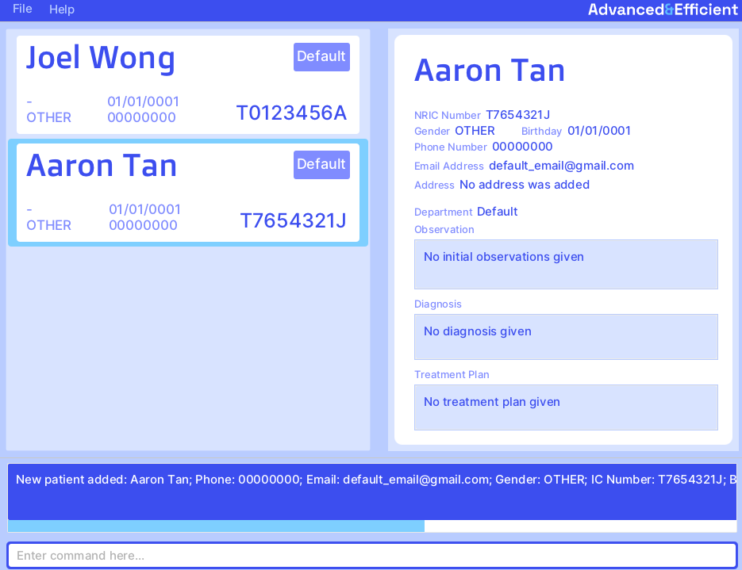

# Advanced&Efficient (A&E) User Guide

Welcome to **Advanced&Efficient (A&E)**!

Advanced&Efficient (A&E) is a powerful **desktop application** designed specifically for **Emergency Department (ED) doctors** who need to **create, update, and manage patients and their records** swiftly and effectively. This application, with its **Command-Line Interface (CLI)**[1](#glossary) design, caters to fast typists and professionals who prefer typing over mouse interactions, significantly speeding up the process of inputting and managing patient data.

Here’s a sneak peek into what A&E offers:
- Streamlined logging of patient reports in a user-friendly CLI environment
- Quick connections to relevant hospital departments for patient referrals
- A comprehensive suite of commands for adding, viewing, editing, and deleting patient records
- An intuitive system for managing patient priority levels and medical tags
- Easy-to-follow command summaries and guides for efficient navigation

A&E combines the simplicity of a CLI with the visual cues of a **Graphical User Interface (GUI)**[2](#glossary), offering you the best of both worlds. If you're comfortable with typing and looking for speed and efficiency in patient management, A&E is tailored just for you.

This User Guide is designed to help you, whether you're a newcomer or an experienced user, to harness the full potential of A&E. Here, you'll find everything you need to streamline your patient management tasks, making your role in the ED more manageable and effective.

Embrace the efficiency of A&E and transform the way you manage patient records in your Emergency Department. Let’s get started!

<!-- * Table of Contents -->

## Table of Contents

- [Table of Contents](#table-of-contents)
- [Using this guide](#using-this-guide)
- [Quick Start](#quick-start)
- [Getting to know A&E](#getting-to-know-a-and-amp-e)
    - [User Interface](#user-interface)
- [Features](#features)
    - [Prefix Summary](#prefix-summary)
    - [Viewing help : `help`](#viewing-help-help)
    - [Listing all patients: `list`](#listing-all-patients-list)
    - [Adding a patient: `add`](#adding-a-patient-add)
    - [Viewing a patient : `view`](#viewing-a-patient-view)
    - [Editing a patient: `edit`](#editing-a-patient-edit)
    - [Deleting a patient: `delete`](#deleting-a-patient-delete)
    - [Finding a patient by name : `find`](#finding-a-patient-by-name-find)
    - [Sorting the patient list : `sort`](#sorting-the-patient-list-sort)
    - [Editing a patient record : `record`](#editing-a-patient-record-record)
    - [Assigning a patient to a department : `assign`](#assigning-a-patient-to-a-department-assign)
    - [Undoing a command : `undo`](#undoing-a-command-undo)
    - [Redoing a command : `redo`](#redoing-a-command-redo)
    - [Clearing all entries : `clear`](#clearing-all-entries-clear)
    - [Exiting the program : `exit`](#exiting-the-program-exit)
    - [Saving the program](#saving-the-program)
    - [Editing the data file](#editing-the-data-file)
- [FAQ](#faq)
- [Known Issues](#known-issues)
- [Command summary](#command-summary)
- [Glossary](#glossary)
- [Appendix : Departments](#appendix-departments)

<page-nav />

--------------------------------------------------------------------------------------------------------------------

## Using this guide

This user guide contains all of the information you will need in order to use A&E.

**For new users:**
* Begin your journey with A&E by exploring the [Quick Start](#quick-start) and
  [Getting to know A&E](#getting-to-know-a-and-amp-e) sections.

**For experienced users:**
* Utilize the [Table of contents](#table-of-contents) to swiftly navigate to your desired section.
* Dive into the [Features](#features) to explore advanced functionalities and optimize your workflow.

Before you delve further into this guide, do take note of the following highlighted information panels.

<box type="info">

**Note:**
Used to highlight information you should pay attention to

</box>

<box type="tip">

**Tip:**
Used to highlight tips which you might find useful

</box>

<box type="warning">

**Caution:**
Used to highlight issues to look out for

</box>

[Back to Table of Contents](#table-of-contents)

--------------------------------------------------------------------------------------------------------------------

## Quick Start

1. Ensure you have Java 11[3](#glossary) or above installed in your Computer.

<box type="tip">

***How to check?***
1. Open up the Terminal on your computer. 
   i.  For Windows users, locate it by typing in “Terminal” in the search bar. 
   ii. For Mac users, locate it by typing in “Terminal” in Spotlight.
2. Type in `java -version` and press Enter.
3. If you have Java installed, you should see your Java version as shown underlined in the picture below.

4. If you do not have Java or your Java version is below 11, install Java
11 [here](https://www.oracle.com/java/technologies/downloads/#java11) based on your Operating System.

</box>

2. Go to your Desktop and create a folder named “AAndE”.

3. Download Advanced&Efficient [here](https://github.com/AY2324S1-CS2103T-T14-2/tp/releases/tag/v1.4) 
   i. After clicking on the link, click on `AdvancedAndEfficient.jar` as seen in the picture below.

    

4. After downloading the application, move it into the “AAndE” folder created in step 2.

5. Open Terminal (as mentioned in step 1 part 1) 
   i.  For Windows, type in `cd Desktop\AAndE` to navigate to the folder you’ve created, and press Enter. 
   ii. For Mac, type in `cd Desktop/AAndE` to navigate to the folder you’ve created, and press Enter. 

   Then, type in `java -jar AdvancedAndEfficient.jar` and press Enter again to run the application.

   A GUI similar to the picture below should appear in a few seconds. Note how the app contains some sample data.

    

<box type="tip">

**Tip:**
We strongly recommend you to use A&E at a resolution of 1024x640 for the fullest experience. You may also click
on the fullscreen icon at the top right hand corner to enlarge the window.

</box>

6. Type the command in the command box and press Enter to execute it. e.g. typing `help` and pressing Enter will open
   the help window.

   Some example commands you can try:

    - `list` : Lists all patients.
    - `add n/John Doe i/T0384762A p/98765432 e/johnd@example.com a/John street, block 123, #01-01` : Adds a patient
      named
      John Doe into the system.
    - `clear` : Deletes all patients.
    - `exit` : Exits the app.

[Back to Table of Contents](#table-of-contents)

--------------------------------------------------------------------------------------------------------------------

## Getting to know A&E

### User Interface

Here is an overview of A&E’s user interface and some of its noteworthy components.

1. Command Bar
2. Console
3. Patient List Panel
4. Patient Record Panel

### Command Bar

This is where you type in commands for the program to run. Refer to the [Features](#features) or
[Command Summary](#command-summary) section for the command inputs accepted by the app.

To begin typing, simply select the command bar by clicking the space that says “Enter command here…”. Then, type in
your command and hit Enter to execute the command!

### Console

This is where status messages are displayed. Status messages are displayed depending on the user input
in the command box.

Status messages provide you with feedback such as:
+ What a command does and its format
+ Why a command input is invalid
+ Whether a command is successful

### Patient List Panel

This is where the list of patients is displayed. It displays either the complete list of all patients in the system
(after `list` command), a filtered list of patients (after `find` command), or a single patient card
(after `view` command).

Patients are listed out vertically. You can scroll through the list using the scrollbar on the right side, your mouse’s
scroll wheel, or your trackpad. To select a patient in the list, simply click on their patient card. The selected
patient is indicated by the light blue border around their patient card.

Each patient is represented by a patient card in the list. Here is an overview of the information displayed in a
patient card.

1. Full Name
2. Age
3. Gender
4. Birthday
5. Phone Number
6. Assigned Department
7. Tag(s)
8. Priority Tag
   
   
   
9. IC Number

### Patient Record Panel

This is where the details and record of the selected patient in the list is displayed. It displays all the details of a
patient and all their patient record information, except for their age. The labels below the patient’s name indicate the
patient’s priority level and tags respectively.

If there is no selected patient in the list, the panel will be blank. (The selected patient is indicated by the light
blue border around their patient card in the patient list panel.)

[Back to Table of Contents](#table-of-contents)

--------------------------------------------------------------------------------------------------------------------
## Features

<box type="info">

**Notes about the command format:** 

* Words in `UPPER_CASE` are the parameters to be supplied by the user.
  e.g. in `add n/NAME`, `NAME` is a parameter which can be used as `add n/John Doe`.

* Items in square brackets are optional.
  e.g `n/NAME [pr/PRIORITY]` can be used as `n/John Doe pr/HIGH` or as `n/John Doe`

* Items with `...` after them can be used multiple times including zero times.
  e.g. `[t/TAG]...` can be used as ` `(i.e. 0 times), `t/critical`, `t/critical t/bedrest` etc.

* Parameters can be in any order.
  e.g. if the command specifies `n/NAME p/PHONE`, `p/PHONE n/NAME` is also acceptable.

* Except for `n/NAME`, all parameters are case-insensitive. e.g. `n/john doe` is different from `n/John Doe`, but
  `i/t1234567a` is the same as `i/T1234567A`.

* Extraneous parameters for commands that do not take in parameters (such as `help`, `list`, `exit`, `undo`, `redo`, and
  `clear`) will be ignored. e.g. if the command specifies `help 123`, it will be interpreted as `help`.

* If you are using a PDF version of this document, be careful when copying and pasting commands that span multiple lines
  as space characters surrounding line-breaks may be omitted when copied over to the application.

</box>

[Back to Table of Contents](#table-of-contents)

### Prefix Summary

For some commands in the subsequent sections, you might come across parameters specified with a prefix
(e.g. prefix `n/` with parameter `NAME` in `n/NAME`). These parameters refer to patient attributes or record fields that are
accepted by the command. Certain parameters have constraints and can only take on certain values. The table below
gives a summary of all parameters, their associated prefixes and their constraints.

| Attribute                                      | Prefix | Parameter        | Constraints/Format                                                                      |
|------------------------------------------------|--------|------------------|-----------------------------------------------------------------------------------------|
| Patient’s full name                            | `n/`   | `NAME`           | Only alphanumeric characters and spaces                                                 |
| Patient’s NRIC number                          | `i/`   | `IC_NUMBER`      | Must be an alphabet, followed by 7 numerical digits, then an alphabet E.g. T0123456A |
| Patient’s gender                               | `g/`   | `GENDER`         | “Male”, “Female” or “Other”                                                             |
| Patient’s birthday                             | `b/`   | `BIRTHDAY`       | Date in the format, DD/MM/YYYY                                                          |
| Patient’s phone number                         | `p/`   | `PHONE`          | Only numbers, at least 3 digits long                                                    |
| Patient’s email address                        | `e/`   | `EMAIL`          | An email address in the format, username@domain.com                                     |
| Patient’s home address                         | `a/`   | `ADDRESS`        | Any values                                                                              |
| Patient’s priority level                       | `pr/`  | `PRIORITY`       | “High”, “Medium”, “Low” or “NIL”                                                        |
| Patient’s tags                                 | `t/`   | `TAG`            | Alphanumeric characters, no spaces                                                      |
| Patient’s assigned department                  | `d/`   | `DEPARTMENT`     | Refer to the [appendix](#appendix-departments) for the list of accepted values          |
| Patient’s initial observations in their record | `o/`   | `OBSERVATION`    | Any values                                                                              |
| Patient’s diagnosis in their record            | `di/`  | `DIAGNOSIS`      | Any values                                                                              |
| Patient’s treatment plan in their record       | `tp/`  | `TREATMENT_PLAN` | Any values                                                                              |

[Back to Table of Contents](#table-of-contents)

### Viewing help: `help`

Shows a message explaining how to access the user guide.

Format: `help`

Expected output when command succeeds:

[Back to Table of Contents](#table-of-contents)

### Listing all patients: `list`

Lists all patients in the system.

Format: `list`

Expected output when command succeeds:

[Back to Table of Contents](#table-of-contents)

### Adding a patient: `add`

Adds a patient into the system

Format: `add n/NAME i/IC_NUMBER [g/GENDER] [b/BIRTHDAY] [p/PHONE_NUMBER] [e/EMAIL] [a/ADDRESS] [pr/PRIORITY] [t/TAG]...`

+ IC number cannot be edited after the patient has been added.

<box type="warning">

**Caution:**
Duplicate patients are not allowed. Duplicate patients refer to patients with the same name and/or IC
number.
+ Names are case-sensitive
  + `Han Bo` is different from `han bo`
+ IC numbers are case-insensitive
  + `T1234567A` is the same as `t1234567a`

</box>

<box type="info">

**Note:**
Optional fields not specified while adding the patient will be filled with default values as shown below.

</box>

Examples:

+ To add a Patient with name "John Doe", IC number "T0123456A", gender "male", and birthday on 1 Jan 1990 
    `add n/John Doe i/T0123456A g/Male b/01/01/1990 `

* To add a patient with name "Betsy Crowe", IC number "S0123456B", phone number "90909090", and email "bc@gmail.com" 
    `add n/Betsy Crowe i/S0123456B p/90909090 e/bc@gmail.com`

[Back to Table of Contents](#table-of-contents)

### Viewing a patient: `view`

Displays a specific patient’s information and medical record.

Format: `view i/IC_NUMBER`

Examples:

+ To view patient with IC number "T0201234A" 
  `view i/T0201234A`

Expected output when command succeeds:

<box type="info">

**Note:**
The command will not display the patient’s record card in the record panel immediately. To view the patient’s
details and record card, you have to click on their patient card in the list.

</box>

[Back to Table of Contents](#table-of-contents)

### Editing a patient: `edit`

Edits the information of a patient with the specified IC number

Format: `edit i/IC_NUMBER [n/NAME] [g/GENDER] [b/BIRTHDAY] [p/PHONE_NUMBER] [e/EMAIL] [a/ADDRESS] [pr/PRIORITY] [t/TAG]...`
+ At least one of the optional fields indicated within square brackets must be provided.

<box type="warning">

**Caution:**
The new name provided cannot be the same as the name of another patient in the list. 
+ Names are case-sensitive
  + `Han Bo` is different from `han bo`

</box>

<box type="info">

**Note:**
When editing tags, the new tags specified will overwrite the existing tags 
i.e. all existing tags will be discarded and replaced 
with the new tags.

</box>

Examples:

* To edit the birthday of a patient with IC number "T0123456A" to 10 Jan 2000  
  `edit i/T0123456A b/10/01/2000`
* To edit the phone number and email of a patient with IC number "S0123456B" to "87621527" and "betsyc@hotmail.com" respectively  
  `edit i/S0123456B b/10/01/2000 e/betsyc@hotmail.com`

[Back to Table of Contents](#table-of-contents)

### Deleting a patient: `delete`

Deletes the patient with the specified IC number.

Format: `delete i/IC_NUMBER`

Examples:

* To delete a patient with IC number "T2468012A"  
  `delete i/T2468012A`

[Back to Table of Contents](#table-of-contents)

### Finding a patient by name: `find`

Finds the patients whose names match any of the given keywords.

Format: `find KEYWORD [MORE_KEYWORDS]...`

- The order of the keywords does not matter. e.g. `Hans Bo` will match `Bo Hans`
- Only the name is searched.
- Only full words will be matched. e.g. `Han` will not match `Hans`.
- Persons matching at least one keyword will be returned. e.g. `Hans Bo` will return `Hans Gruber`, `Bo Yang`.

Example commands:
- To find patients whose name matches "John"

    `find john`
- To find patients whose name matches "Mary" and "Jane"

    `find Mary Jane`

[Back to Table of Contents](#table-of-contents)

### Sorting the patient list: `sort`

Sorts the patient list based on the given property.

<box type="info">

**Note:**
It sorts both the filtered and full patient list. For example, if you run `find John` followed by `sort age` on the
list of search results, it will also sort the complete list of patients (displayed using the `list` command).

</box>

Format: `sort PROPERTY`

+ `PROPERTY` can only be `name`, `ic`, `department`, `age`, or `priority`.

Examples:

+ To sort the patient list according to name in alphanumeric order 
  `sort name`
+ To sort the patient list according to IC number in alphanumeric order 
  `sort ic`
+ To sort the patient list according to department (with default departments at the bottom of the list) 
  `sort department`
+ To sort the patient list according to ascending age (with default age at the top of the list) 
  `sort age`
+ To sort the patient list according to descending priority 
  `sort priority`

[Back to Table of Contents](#table-of-contents)

### Editing a patient record: `record`

Edits the medical record of the patient with the specified IC number.

Format: `record i/IC_NUMBER [o/INITAL_OBSERVATIONS] [di/DIAGNOSIS] [tp/TREATMENT_PLAN]`
+ At least one of the optional fields indicated within square brackets must be provided.

Examples:

* To edit the medical record of a patient with IC number "T0201234A" 
  `record i/T0201234A o/Broken Arm di/Hairline fracture tp/Cast for 2 days`
* To edit the medical record of a patient with IC number "S2374912B" 
  `record i/S2374912B di/Asthma o/Shortness of breath and chest tightness`

[Back to Table of Contents](#table-of-contents)

### Assigning a patient to a department: `assign`

Assigns a patient to a hospital department.

Format: `assign i/IC_NUMBER d/DEPARTMENT`

<box type="warning">

**Caution:**
`DEPARTMENT` must adhere to British spelling conventions. Refer to the [appendix](#appendix-departments)
below for the list of valid departments and their accepted inputs.

</box>

Examples:

* To assign a patient with IC number "T0201234A" to the cardiology department 
  `assign i/T0201234A d/cardiology`

[Back to Table of Contents](#table-of-contents)

### Undoing a command: `undo`

Undos the most recent command. Only applies to the following commands:

+ `delete`
+ `edit`
+ `clear`
+ `add`
+ `assign`

Format: `undo`

Examples:

+ `delete i/T1234567A` deletes the patient with the IC number "T1234567A" from the patient list.
  `undo` restores this patient back into the patient list.

[Back to Table of Contents](#table-of-contents)

### Redoing a command: `redo`

Redos the most recently undone command. Only applies to the following commands:

+ `delete`
+ `edit`
+ `clear`
+ `add`
+ `assign`

Format: `redo`

Examples:

+ `delete i/T1234567A` deletes the patient with IC number "T1234567A" from the patient list
  `undo` restores this patient back into the patient list.
  `redo` once again deletes this patient from the patient list.

[Back to Table of Contents](#table-of-contents)

### Clearing all entries: `clear`

Clears all patients from the system.

Format: `clear`

[Back to Table of Contents](#table-of-contents)

### Exiting the program: `exit`

Exits the program.

Format: `exit`

[Back to Table of Contents](#table-of-contents)

### Saving the program

Advanced&Efficient data is saved in the hard disk automatically after any command that changes the data. There is no
need to
save manually.

[Back to Table of Contents](#table-of-contents)

### Editing the data file

Advanced&Efficient data are saved automatically as a JSON file `[JAR file location]/data/aande.json`. Advanced
users are
welcome to update data directly by editing that data file.

<box type="warning">

**Caution:**
If your changes to the data file makes its format invalid, Advanced&Efficient will discard all data and start with an
empty data file at the next run. Hence, it is recommended to take a backup of the file before editing it.

</box>

[Back to Table of Contents](#table-of-contents)

--------------------------------------------------------------------------------------------------------------------

## FAQ

**Q**: I double-clicked the Jar file and it doesn't run, why?\
**A**: Make sure that Java 11 is installed and do refer to step 5 of [Quick Start](#quick-start) for instructions to run
application.

**Q**: I have a list of patients, how do I view their details?\
**A**: Please click on the patient you are interested in viewing. The details will be on the right hand side in the
Patient Record Panel.

**Q**: The Patient List Panel is cut off, I cant see some details for each patient\
**A**: Please resize the application by dragging the border of the application window with your mouse. If the appplication is already in full screen mode, please drag the divider between the Patient List Panel and Patient
Record Panel to the right.

**Q**: I entered a command and there is no response from the application, what do I do?\
**A**: A critical error might have occured. Please ensure your command is as specified in [Features](#features). Please contact
the technical team in charge of your department to file a bug report on our [issues](https://github.com/AY2324S1-CS2103T-T14-2/tp/issues) page.

**Q**: I have accidentally cleared the whole patient record system, can I retrieve the lost details?\
**A**: Yes, A&E has the [Undo](#undoing-a-command-undo) feature which allows you to retrieve all the lost details.

**Q**: Will my data be saved immediately?\
**A**: Yes, A&E saves your data after every command executed.

**Q**: How do I transfer my data to another Computer?\
**A**: Install the app in the other computer and overwrite the empty data file it creates with the file that contains
the data of your previous AAndE home folder.

[Back to Table of Contents](#table-of-contents)

--------------------------------------------------------------------------------------------------------------------

## Known issues

1. When using multiple screens, if you move the application to a secondary screen, and later switch to using only the
   primary screen, the GUI will open off-screen. The remedy is to delete the preferences.json file created by the
   application before running the application again.

2. Age is not displayed in the Patient Record Panel of UI.

3. The UI of the app might appear ‘squashed’ upon launch i.e. not all details can be visible. To avoid this, we advise
   users to use our application in full screen.

4. The use of extra and invalid prefixes/parameters will not be detected properly, resulting in the wrong error message
   being displayed.

5. Long tags cannot be displayed properly in the app and might overlap with other details of patients. As such, we
   advise against the use of long tags.

6. Some invalid birthdays can be added/edited to a patient e.g. 30 February.

7. For the `view` command, users will have to click on the patient themselves in order to see the patient’s details and
   record.

8. The minimize button for the help window might not work for some users.

9. Currently, any alphabets are accepted for the start of an IC number. Ideally, only letters "S", "T", "F", "G" or "M"
   are accepted for the start of an IC number.

[Back to Table of Contents](#table-of-contents)

--------------------------------------------------------------------------------------------------------------------

## Command summary

| Action     | Format, Examples                                                                                                                                                                                                                                   |
|------------|----------------------------------------------------------------------------------------------------------------------------------------------------------------------------------------------------------------------------------------------------|
| **Help**   | `help`                                                                                                                                                                                                                                             |
| **List**   | `list`                                                                                                                                                                                                                                             |
| **Add**    | `add n/NAME i/IC_NUMBER [g/GENDER] [b/BIRTHDAY] [p/PHONE_NUMBER] [e/EMAIL] [a/ADDRESS] [pr/PRIORITY] [t/TAG]...`   e.g. `add n/Betsy Crowe i/S0123456B g/FEMALE b/23/12/1994 p/90909090 e/bc@gmail.com a/Old Town Road 4 pr/low t/stable`       |
| **View**   | `view i/IC_NUMBER`  e.g. `view i/T0201234A`                                                                                                                                                                                                     |
| **Edit**   | `edit i/IC_NUMBER [n/NAME] [g/GENDER] [b/BIRTHDAY] [p/PHONE] [e/EMAIL] [a/ADDRESS] [pr/PRIORITY] [t/TAG]...`  e.g. `edit i/T0201234A n/Moira Crow g/MALE b/08/08/1999 p/93827836 e/example@email.com a/Old Time Road Block 3 pr/high t/bedrest` |
| **Delete** | `delete i/IC_NUMBER`  e.g. `delete i/T2468012A`                                                                                                                                                                                                 |
| **Find**   | `find KEYWORD [MORE_KEYWORDS]...`  e.g. `find Mary Jane`                                                                                                                                                                                        |
| **Sort**   | `sort PROPERTY`  e.g. `sort name`, `sort ic`, `sort department`, `sort age`, `sort priority`                                                                                                                                                    |
| **Record** | `record i/IC_NUMBER [o/INITAL_OBSERVATIONS] [di/DIAGNOSIS] [tp/TREATMENT_PLAN]`  e.g. `record i/T0201234A o/Broken Arm di/Hairline fracture tp/Cast for 2 days`                                                                                 |
| **Assign** | `assign i/IC_NUMBER d/DEPARTMENT`  e.g. `assign i/T0201234A d/Cardiology`                                                                                                                                                                       |
| **Undo**   | `undo`                                                                                                                                                                                                                                             |
| **Redo**   | `redo`                                                                                                                                                                                                                                             |
| **Clear**  | `clear`                                                                                                                                                                                                                                            |
| **Exit**   | `exit`                                                                                                                                                                                                                                             |

[Back to Table of Contents](#table-of-contents)

--------------------------------------------------------------------------------------------------------------------

## Glossary

1. **Command-Line Interface**
    
    A command-line interface (CLI) is a text-based user interface (UI) used to run programs, 
    manage computer files and interact with the computer, involving more typing than clicking.

2. **Graphical User Interface**

    A graphical user interface (GUI) is a digital interface in which a user interacts with graphical components such as
    icons, buttons, and menus, often by clicking.

3. **Java 11**

   Java is the programming language used in creating A&E. “11” refers to the version of the language used.

[Back to Table of Contents](#table-of-contents)

--------------------------------------------------------------------------------------------------------------------

## Appendix: Departments

The table below shows all the hospital departments available in the system and their accepted inputs.

Related commands: [Assign](#assigning-a-patient-to-a-department-assign)

| Department           | Acceptable Input(s)    |
|----------------------|------------------------|
| Default              | `Default`              |
| Anaesthesiology      | `Anaesthesiology`      |
| Cardiology           | `Cardiology`           |
| Dermatology          | `Dermatology`          |
| Emergency Department | `Emergency Department` |
| Endocrinology        | `Endocrinology`        |
| General Surgery      | `General Surgery`      |
| Geriatric Medicine   | `Geriatric Medicine`   |
| Gynaecology          | `Gynaecology`          |
| Haematology          | `Haematology`          |
| Immunology           | `Immunology`           |
| Infectious Diseases  | `Infectious Diseases`  |
| Intensive Care Unit  | `Intensive Care Unit`  |
| Oncology             | `Oncology`             |
| Ophthalmology        | `Ophthalmology`        |
| Orthopaedics         | `Orthopaedics`         |
| Neurology            | `Neurology`            |
| Neurosurgery         | `Neurosurgery`         |
| Pathology            | `Pathology`            |
| Palliative Medicine  | `Palliative Medicine`  |
| Plastic Surgery      | `Plastic Surgery`      |
| Psychiatry           | `Psychiatry`           |
| Radiology            | `Radiology`            |
| Urology              | `Urology`              |

[Back to Table of Contents](#table-of-contents)
